# MY HOME-ASSISTANT CONFIG


Hardware:  
 - Raspberry-Pi 5
 - 128GB SSD
 - TI Zigbee Dongle (CC2652P)
 - 5A Power Supply   

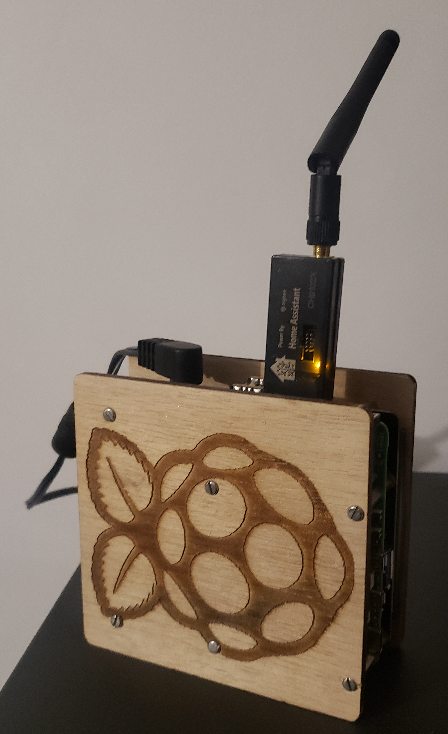
<br>
<br>
<br>

Zigbee Devices  
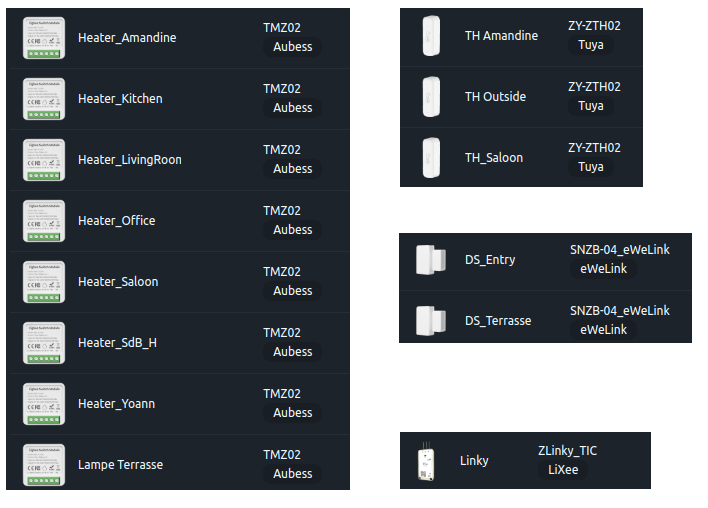

<br>
<br>

### Fil Pilote Devices  

Principes  

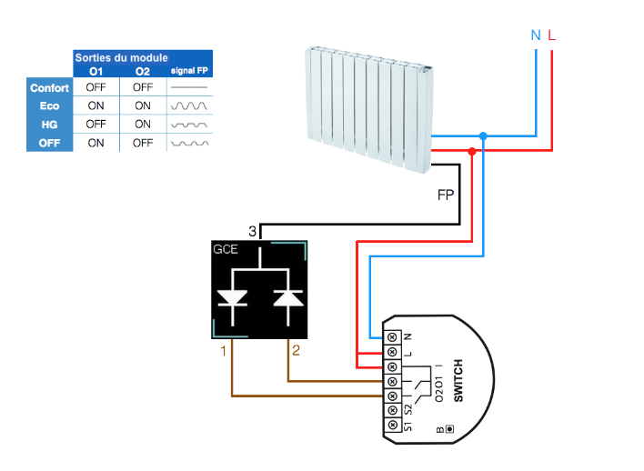
<br>
<br>

Tuya or Aubess 2 Gangs switch modified with 2 diodes  

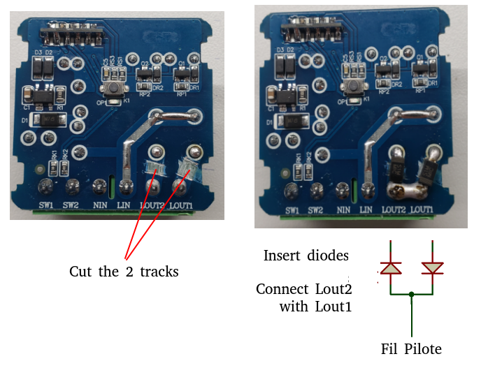

<br>
<br>
<br>

# Cards  

### Home Page  
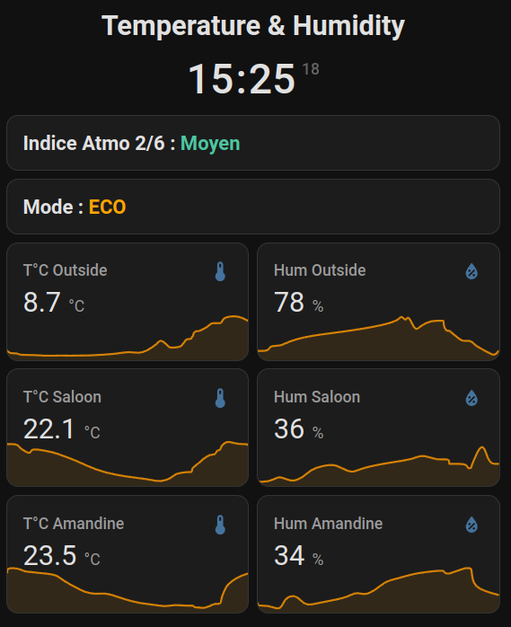  

### Mountains Wheater 
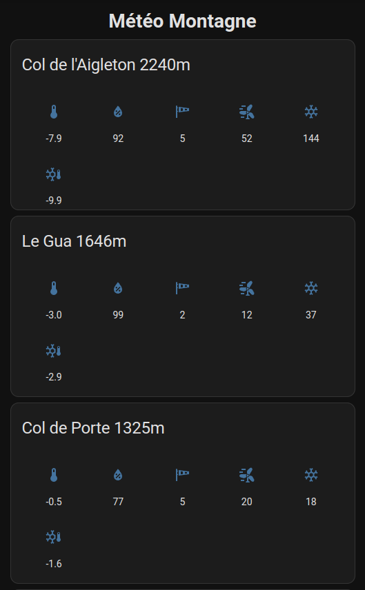  

### Electric Heaters  
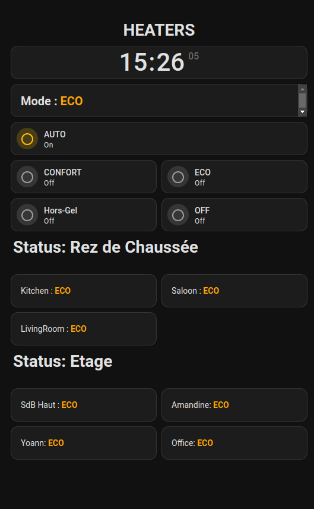

### Lights  
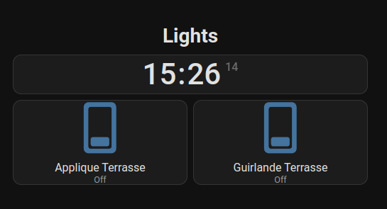

### Power Meter From Linky
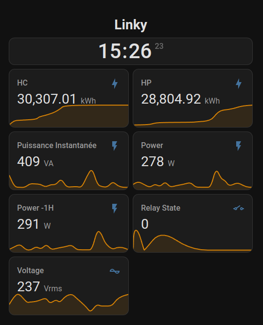

### Doors Sensors
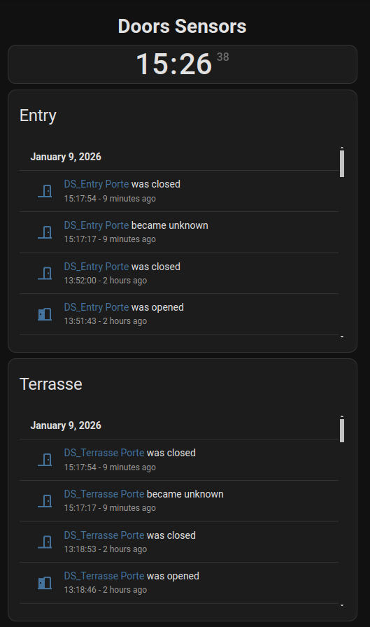

### Batteries Levels
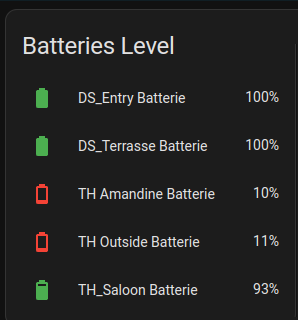

### Network Info
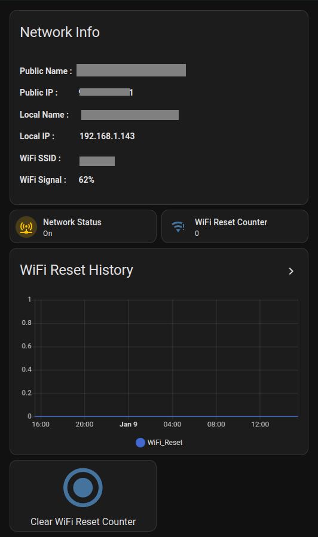
<br>
<br>
<br>

## Add-ons used

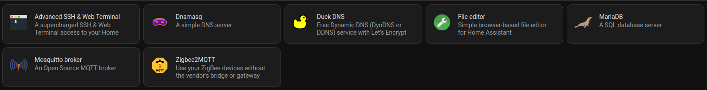

## Integrations used

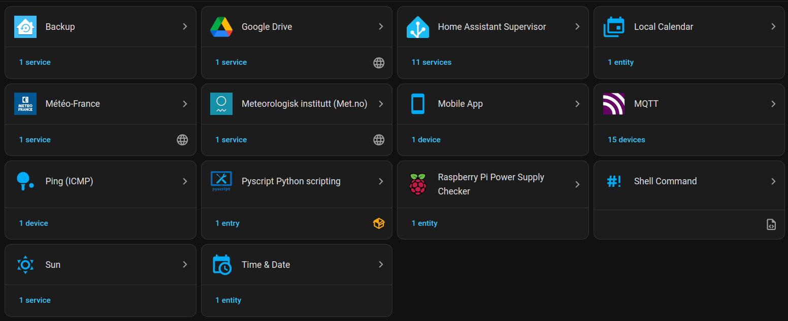


# Advance SSH & Web terminal

In order to have allow execution of shell_command 
Create a directory inside /config  
```
cd config 
mkdir .ssh 
```
copy inside the directory your ssh public key __ssh_host_rsa_key.pub_ located in the directory __data__  
Add also the key also inside the add-ons configuration  


# Link and notes

Cool link for yaml essential:  https://yamline.com/tutorial/
a good home-assistant config : https://github.com/basnijholt/home-assistant-config/tree/master


